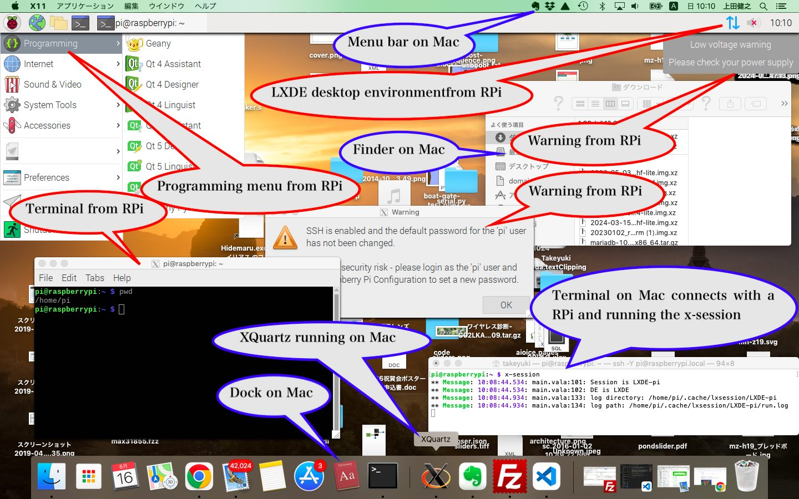

# x-session
Run RPi Desktop environment on Mac (or others) through X11 forwarding.

## How does this work
The RPi desktop, which is connected from a Mac (or others like Windows, Linux, etc.), is merged on the Mac (or others) as follows:


## How to install

1. ```git clone https://github.com/UedaTakeyuki/x-session.git```
2. ```cd x-session```
3. ```sudo ./setup.sh```

Then, the ***x-session*** is symbolic-linked to /usr/local/bin.

## History
- 2024.06.15 Created from scratch
